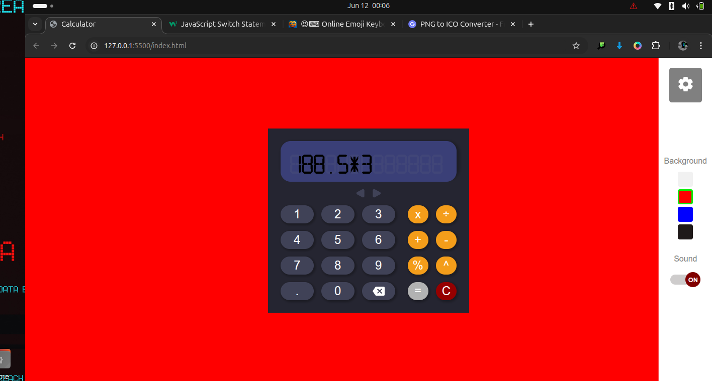

# 🔢 Calculator Web App by Ibukunola Mabawonku

This is a simple and fun calculator built as my ALTSchool Africa First Semester Project. It performs basic arithmetic operations and comes with interactive UI features to enhance user experience.

## 🚀 Features

- 🎨 **Color Selection:** Customize the calculator's theme with multiple color options.
- 🔊 **Sound Effects:** Hear satisfying sounds for every button press.
- 🧼 **Clear Button:** Reset the entire calculation in one click.
- ⌫ **Delete Button:** Remove the last digit or character from your input.
- 📘 **Delete Button:** History section to show past computations.
- 😄 **Fun UI:** Engaging, animated, and user-friendly interface for a smooth experience.
- 🔢 **Basic Operations:** Perform addition, subtraction, multiplication, and division.
- 📱 **Responsive Design:** Works perfectly on mobile and desktop screens.

## 🛠️ Technologies Used

- HTML  
- CSS  
- JavaScript

## 📷 Screenshot

## 📝 How to Use

1. Open the calculator in your browser.
2. Click the buttons to input numbers and operations.
3. Use the `=` button to get results.
4. Use `C` to clear and `←` to delete the last digit.
5. Use from the Settings Navigation the color picker to switch themes and enjoy the sound effects!

## 👨‍💻 Author

**Mareola Official**  
[GitHub Profile](https://github.com/mareola-mabs)  
AltSchool Africa Student
